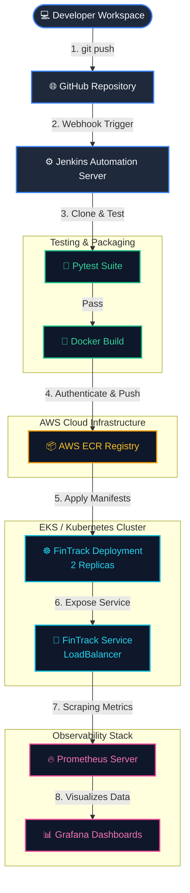

# 📈 FinTrack: End-to-End GitOps CI/CD Pipeline

Welcome to **FinTrack**, a comprehensive personal finance tracking application built using **Python Flask** and deployed via a state-of-the-art **GitOps CI/CD pipeline**. This project demonstrates a production-ready software delivery lifecycle—integrating unit testing, automated Docker image builds, AWS ECR publishing, Kubernetes orchestration, and active cluster monitoring using Prometheus and Grafana.

---

## 🗺️ System & CI/CD Flow Diagram

The flowchart below displays the automated lifecycle of a code change, from the developer's commit to live Kubernetes deployment and monitoring setup:



---

## 🚀 Key Features

*   **Python Flask Backend:** Structured around blueprints, models, templates, and config controls.
*   **Secure Authentication:** Integrated user signup, login, and session persistence using Flask-Login and Flask-Bcrypt.
*   **Personal Finance Dashboard:** Clean visualization of user incomes, expenses, and budget limits.
*   **Fully Automated CI/CD:** Declared through a modular, robust Jenkinsfile pipeline.
*   **Containerized Environment:** Optimized Dockerfile using a lightweight Python base image.
*   **Kubernetes Orchestration:** Zero-downtime rollouts, self-healing pod replication, and LoadBalancer integration.
*   **Real-time Observability:** Active metrics gathering and dashboard visualization.

---

## 📂 Repository Layout

```text
fintrack/
├── Dockerfile                      # Multistage-ready Python Dockerfile
├── Jenkinsfile                     # Declarative pipeline executing CI/CD
├── README.md                       # This comprehensive documentation
├── fintrack/                       # Core Flask application source
│   ├── app.py                      # Application entry point & factory
│   ├── config.py                   # Configuration environment loaders
│   ├── extensions.py               # Flask plugin instantiations (DB, Bcrypt, Login)
│   ├── requirements.txt            # Python dependencies manifest
│   ├── models/                     # SQLAlchemy database schemas (User, Budget, Income, Expense)
│   ├── routes/                     # Blueprint handlers (Auth, Dashboard, Expense, Income)
│   ├── static/                     # CSS stylesheets and interactive client scripts
│   ├── templates/                  # Jinja2 HTML layout views
│   └── tests/                      # Automated unit test files
│       └── test_app.py             # Test assertions for routes and config
├── k8s/                            # Kubernetes manifest configurations
│   ├── fintrack-deployment.yaml    # Application deployment & load-balancer service
│   ├── fintrack-service.yaml       # Isolated app service definition
│   ├── prometheus.yaml             # Prometheus deployment, namespace, config map, service
│   └── grafana.yaml                # Grafana server, namespace, service
└── result/                         # Build artifacts and status captures
    ├── flow_diagram.png            # Static system flow diagram
    └── jenkins_pipeline.png        # Screenshot of successful Jenkins pipeline run
```

---

## 🛠️ Getting Started (Local Development)

To run the Flask application locally on your machine, follow these steps:

### 1. Prerequisites
Ensure you have **Python 3.11+** and **pip** installed.

### 2. Setup Virtual Environment
Clone the repository, navigate to the `fintrack` source directory, and spin up a virtual environment:
```bash
# Clone the repository (if not already done)
git clone https://github.com/VishnuSaravanan335/fintrack.git
cd fintrack

# Create virtual environment
python -m venv venv

# Activate virtual environment
# On Windows (PowerShell):
venv\Scripts\Activate.ps1
# On Linux/macOS:
source venv/bin/activate
```

### 3. Install Dependencies
Install all package requirements listed in [requirements.txt](file:///w:/fintrack/fintrack/requirements.txt):
```bash
pip install -r fintrack/requirements.txt
```

### 4. Run the Application
Start the Flask development server:
```bash
cd fintrack
python app.py
```
Open your browser and navigate to: **`http://127.0.0.1:5000`**

### 5. Running Tests
Run the unit test suite locally using `pytest`:
```bash
pytest tests/
```

---

## 🐳 Containerization with Docker

You can package the application into a Docker container locally. The container is defined in the [Dockerfile](file:///w:/fintrack/Dockerfile).

### 1. Build the Docker Image
```bash
docker build -t fintrack-app:latest .
```

### 2. Run the Container
Map port `5000` on your host machine to port `5000` inside the container:
```bash
docker run -d -p 5000:5000 --name fintrack fintrack-app:latest
```
Access the application at: **`http://localhost:5000`**

---

## ⚙️ Declarative Jenkins CI/CD Pipeline

The [Jenkinsfile](file:///w:/fintrack/Jenkinsfile) automates the delivery pipeline through the following stages:

1.  **Clone Repository:** Downloads the latest branch from GitHub.
2.  **Run Tests:** Runs python-based testing using `pytest`.
3.  **Build Docker Image:** Tags the image using the current Jenkins `$BUILD_NUMBER`.
4.  **Push Docker Image to ECR:** Authenticates with AWS ECR using stored credentials (`aws-creds`) and pushes the image.
5.  **Deploy to Kubernetes:** 
    *   Applies [k8s/fintrack-deployment.yaml](file:///w:/fintrack/k8s/fintrack-deployment.yaml).
    *   Updates the Deployment image tag to target the newly built ECR image.
    *   Verifies rollout status.
6.  **Monitoring Setup - Grafana:** Deploys the Grafana monitoring workspace.

---

## ☸️ Kubernetes Orchestration

The application is deployed to Kubernetes in the `default` namespace.

*   **Deployment:** Creates 2 replica pods of `fintrack-flask` for high-availability.
*   **Service:** Configured as a `LoadBalancer` to expose port `5000` to external traffic.

To deploy or update manually:
```bash
kubectl apply -f k8s/fintrack-deployment.yaml
```

---

## 📊 Prometheus & Grafana Monitoring

Observability resources are stored in the `monitoring` namespace.

### Prometheus Setup
Prometheus is configured via config maps to scrape metrics directly from the application service:
```bash
kubectl apply -f k8s/prometheus.yaml
```

### Grafana Setup
Grafana provides real-time dashboards to monitor the application cluster health:
```bash
kubectl apply -f k8s/grafana.yaml
```

*   **Access Port:** Grafana is exposed via NodePort `30300`.
*   **Access URL:** `http://<Node-IP>:30300` (or `http://<EC2-Public-IP>:30300`)

---

## 🏆 Pipeline Executions & Artifacts

### CI/CD System Architecture
Below is the visual overview of the CI/CD pipeline lifecycle:


### Jenkins Success Output
Screenshot of a successful pipeline run showing completed stages and test validation:


