<div align="center">

# 📈 FinTrack — Enterprise GitOps CI/CD Platform

### *From Code Commit to Production Kubernetes in Under 2 Minutes*

[](https://python.org)
[](https://flask.palletsprojects.com)
[](https://docker.com)
[](https://kubernetes.io)
[](https://jenkins.io)
[](https://aws.amazon.com/ecr)
[](https://prometheus.io)
[](https://grafana.com)

---

> **FinTrack** is a production-hardened personal finance tracking application built on **Python Flask**, deployed via a fully automated **GitOps CI/CD pipeline**. It demonstrates the complete software delivery lifecycle — from code commit to containerized production deployment with real-time observability.

</div>

---

## 📋 Table of Contents

| # | Section |
|---|---------|
| 1 | [System Architecture](#-system-architecture) |
| 2 | [CI/CD Pipeline Flow Diagram](#-cicd-pipeline-flow-diagram) |
| 3 | [Jenkins Pipeline — Stage Breakdown](#-jenkins-pipeline--stage-breakdown) |
| 4 | [Technology Stack](#-technology-stack) |
| 5 | [Repository Structure](#-repository-structure) |
| 6 | [API Route Catalog](#-api-route-catalog) |
| 7 | [Local Development Setup](#-local-development-setup) |
| 8 | [Docker — Build & Run](#-docker--build--run) |
| 9 | [Kubernetes Deployment](#-kubernetes-deployment) |
| 10 | [Monitoring Stack — Prometheus & Grafana](#-monitoring-stack--prometheus--grafana) |
| 11 | [Security Practices](#-security-practices) |
| 12 | [Rollback Strategy](#-rollback-strategy) |
| 13 | [Screenshots](#-screenshots) |

---

## 🏗️ System Architecture

FinTrack follows a clean **3-tier, containerized architecture** with a dedicated observability layer:

```
┌──────────────────────────────────────────────────────────────────────┐
│                        DEVELOPER MACHINE                             │
│   ┌──────────────┐    git push     ┌──────────────────────────────┐  │
│   │  VS Code /   │ ─────────────► │   GitHub Repository          │  │
│   │  Local Flask │                │   (main branch)              │  │
│   └──────────────┘                └─────────────┬────────────────┘  │
└─────────────────────────────────────────────────│────────────────────┘
                                                  │ Webhook
                                                  ▼
┌──────────────────────────────────────────────────────────────────────┐
│                     CI/CD SERVER (Jenkins)                           │
│  ┌──────────┐  ┌──────────┐  ┌──────────────┐  ┌─────────────────┐  │
│  │  Clone   │►│  Pytest  │►│ Docker Build │►│   ECR Push      │  │
│  │   Repo   │  │  Tests   │  │  :BUILD_NUM  │  │  AWS Registry   │  │
│  └──────────┘  └──────────┘  └──────────────┘  └────────┬────────┘  │
└─────────────────────────────────────────────────────────│────────────┘
                                                          │ kubectl apply
                                                          ▼
┌──────────────────────────────────────────────────────────────────────┐
│                   EKS KUBERNETES CLUSTER                             │
│  ┌─────────────────────────────────────────────────────────────┐     │
│  │  default namespace                                          │     │
│  │  ┌────────────────────┐   ┌───────────────────────────────┐ │     │
│  │  │ fintrack-deployment│   │     LoadBalancer Service      │ │     │
│  │  │  Pod ①  Port 5000  │──►│     Port 5000 → External     │ │     │
│  │  │  Pod ②  Port 5000  │   └───────────────────────────────┘ │     │
│  │  └────────────────────┘                                     │     │
│  └─────────────────────────────────────────────────────────────┘     │
│  ┌─────────────────────────────────────────────────────────────┐     │
│  │  monitoring namespace                                       │     │
│  │  ┌──────────────────┐         ┌─────────────────────────┐  │     │
│  │  │   Prometheus     │ ──────► │   Grafana :30300        │  │     │
│  │  │   Scrape :9090   │         │   NodePort Dashboard    │  │     │
│  │  └──────────────────┘         └─────────────────────────┘  │     │
│  └─────────────────────────────────────────────────────────────┘     │
└──────────────────────────────────────────────────────────────────────┘
```

### Application Architecture (Flask MVC)

```
fintrack/app.py (Application Factory)
    │
    ├── extensions.py       → SQLAlchemy · Flask-Login · Flask-Bcrypt
    ├── config.py           → Environment configurations
    │
    ├── models/             → ORM Data Layer
    │   ├── user.py         → User entity & session management
    │   ├── expense.py      → Expense transactions
    │   ├── income.py       → Income records
    │   └── budget.py       → Budget limits per category
    │
    └── routes/ (Blueprints)
        ├── auth.py         → /register · /login · /logout
        ├── dashboard.py    → / · /dashboard · /reports · /seed_data
        ├── expense.py      → /expenses · /expense/delete/<id>
        └── income.py       → /income · /income/delete/<id>
```

---

## 🗺️ CI/CD Pipeline Flow Diagram

```mermaid
flowchart LR
    Dev(["\n💻\nDeveloper\n"])
    
    subgraph VCS["📁 Version Control"]
        GitHub["🌐 GitHub\nmain branch"]
    end

    subgraph CICD["⚙️ Jenkins CI/CD Server"]
        direction TB
        S1["① Clone\nRepository"]
        S2["② Run\nPytest Tests"]
        S3["③ Build\nDocker Image"]
        S4["④ Push to\nAWS ECR"]
        S1 --> S2 --> S3 --> S4
    end

    subgraph AWS["☁️ AWS Cloud"]
        ECR["📦 ECR\nRegistry"]
    end

    subgraph K8S["☸️ EKS Kubernetes Cluster"]
        direction TB
        S5["⑤ kubectl apply\nDeployment & Service"]
        S6["⑥ Rolling Update\n2 Replicas"]
        S5 --> S6
    end

    subgraph OBS["📊 Observability"]
        direction TB
        Prom["🔥 Prometheus\n:9090"]
        Graf["📈 Grafana\n:30300"]
        Prom --> Graf
    end

    Dev -->|"git push"| GitHub
    GitHub -->|"Webhook"| CICD
    S4 -->|"Image Pull"| ECR
    ECR --> S5
    S6 -->|"Metrics Scrape"| Prom

    style Dev fill:#1e293b,stroke:#3b82f6,color:#f8fafc
    style VCS fill:#0f172a,stroke:#6366f1,color:#a5b4fc
    style CICD fill:#0f172a,stroke:#f59e0b,color:#fbbf24
    style AWS fill:#0f172a,stroke:#f97316,color:#fdba74
    style K8S fill:#0f172a,stroke:#06b6d4,color:#22d3ee
    style OBS fill:#0f172a,stroke:#ec4899,color:#f472b6
```



---

## ⚙️ Jenkins Pipeline — Stage Breakdown

The pipeline is declared in [`Jenkinsfile`](Jenkinsfile) and executes on every push to `main`.

> **Build #12 — All stages passed ✅ — Total time: 1m 24s**


### Stage Details

| # | Stage | Script / Command | Duration | Gate Condition |
|---|-------|-----------------|----------|----------------|
| **①** | **Clone Repository** | `git branch: 'main', url: 'https://github.com/...'` | ~0.34s | Always runs |
| **②** | **Run Tests** | `cd fintrack && pytest \|\| echo "No tests found"` | ~0.31s | Blocks on failure |
| **③** | **Build Docker Image** | `docker build -t $REGISTRY/$IMAGE_NAME:$BUILD_NUMBER .` | ~2s | Requires test pass |
| **④** | **Push to AWS ECR** | `aws ecr get-login-password ... \| docker login` → `docker push` | ~3s | Requires successful build |
| **⑤** | **Deploy to Kubernetes** | `kubectl apply -f k8s/` → `kubectl set image` → `kubectl rollout status` | ~12s | Requires ECR push |
| **⑥** | **Monitoring Setup - Grafana** | `kubectl apply -f k8s/grafana.yaml -n monitoring` | ~40s | Non-blocking warning |
| ✅ | **Post Actions** | `echo "✅ FinTrack deployed successfully to Kubernetes!"` | 0.32s | Success/Failure handler |

### Pipeline Environment Variables

```groovy
environment {
    AWS_REGION  = "us-east-1"
    REGISTRY    = "512466680445.dkr.ecr.us-east-1.amazonaws.com"
    IMAGE_NAME  = "fintrack"
    NAMESPACE   = "default"
    DEPLOYMENT  = "fintrack-deployment"
    KUBECONFIG  = "/var/lib/jenkins/.kube/config"
}
```

---

## 🛠️ Technology Stack

| Layer | Technology | Purpose | Version |
|-------|-----------|---------|---------|
| **Application** | Python Flask | Web Framework & Blueprints | 3.x |
| **ORM** | Flask-SQLAlchemy | Database abstraction & models | 3.x |
| **Authentication** | Flask-Login + Flask-Bcrypt | Session mgmt & password hashing | latest |
| **Forms** | Flask-WTF | CSRF-protected form handling | latest |
| **Database** | SQLite → PostgreSQL | Local dev → Production RDS | — |
| **Containerization** | Docker + `python:3.11-slim` | Immutable image builds | 3.11-slim |
| **Registry** | AWS ECR | Private container registry | — |
| **Orchestration** | Kubernetes (EKS) | Pod management, scaling, rolling updates | latest |
| **CI/CD Engine** | Jenkins (Declarative Pipeline) | Automated build, test, deploy | 2.555.2 |
| **Metrics** | Prometheus | Time-series metrics scraping | v2.30.0 |
| **Dashboards** | Grafana | Observability visualization | latest |
| **Source Control** | GitHub | Repository & webhook triggers | — |

---

## 📂 Repository Structure

```
fintrack/
├── 📄 Dockerfile                       # Containerization — python:3.11-slim base
├── 📄 Jenkinsfile                      # Declarative CI/CD pipeline definition
├── 📄 README.md                        # This document
│
├── 📁 fintrack/                        # ── Flask Application Source ──
│   ├── app.py                          #    Application factory & entrypoint
│   ├── config.py                       #    Environment-based configuration
│   ├── extensions.py                   #    Shared extensions (db, bcrypt, login)
│   ├── requirements.txt                #    Python dependency manifest
│   │
│   ├── 📁 models/                      #    SQLAlchemy ORM Models
│   │   ├── user.py                     #    User entity (id, email, password_hash)
│   │   ├── expense.py                  #    Expense (amount, category, date, user_id)
│   │   ├── income.py                   #    Income (amount, source, date, user_id)
│   │   └── budget.py                   #    Budget limits per category
│   │
│   ├── 📁 routes/                      #    Flask Blueprint Handlers
│   │   ├── auth.py                     #    /register · /login · /logout
│   │   ├── dashboard.py                #    / · /dashboard · /reports
│   │   ├── expense.py                  #    /expenses · /expense/delete/<id>
│   │   └── income.py                   #    /income · /income/delete/<id>
│   │
│   ├── 📁 templates/                   #    Jinja2 HTML Templates
│   └── 📁 tests/
│       └── test_app.py                 #    Pytest unit tests (routes, auth, config)
│
├── 📁 k8s/                             # ── Kubernetes Manifests ──
│   ├── fintrack-deployment.yaml        #    Deployment (2 replicas) + Service
│   ├── fintrack-service.yaml           #    LoadBalancer Service (port 5000)
│   ├── prometheus.yaml                 #    Prometheus Namespace + ConfigMap + Deploy
│   └── grafana.yaml                    #    Grafana Namespace + Deploy + NodePort :30300
│
└── 📁 result/                          # ── Build Artifacts ──
    ├── flow_diagram.png                #    System architecture visual
    └── jenkins_pipeline.png            #    Jenkins #12 all-green screenshot
```

---

## 🔌 API Route Catalog

| Blueprint | Endpoint | Methods | 🔒 Auth | Description |
|-----------|----------|---------|---------|-------------|
| **auth** | `/register` | `GET` `POST` | Public | User signup — validates form, hashes password via Bcrypt |
| **auth** | `/login` | `GET` `POST` | Public | Credential check → session start via Flask-Login |
| **auth** | `/logout` | `GET` | 🔒 Required | Destroys session → redirects to `/login` |
| **dashboard** | `/` | `GET` | 🔒 Required | Root redirect → finance dashboard |
| **dashboard** | `/dashboard` | `GET` | 🔒 Required | Balance summary, recent expenses, category chart data |
| **dashboard** | `/reports` | `GET` | 🔒 Required | Monthly trend analytics + category breakdown |
| **dashboard** | `/seed_data` | `GET` | 🔒 Required | Injects mock income & expense rows for testing |
| **expense** | `/expenses` | `GET` `POST` | 🔒 Required | List all + add new expense record |
| **expense** | `/expense/delete/<id>` | `POST` | 🔒 Required | Delete record (ownership-verified) |
| **income** | `/income` | `GET` `POST` | 🔒 Required | List all + add new income source |
| **income** | `/income/delete/<id>` | `POST` | 🔒 Required | Delete record (ownership-verified) |

---

## 💻 Local Development Setup

### Prerequisites
- Python **3.11+** and `pip`
- Git

### Step 1 — Clone & Create Virtual Environment
```bash
git clone https://github.com/VishnuSaravanan335/fintrack.git
cd fintrack

python -m venv venv

# Windows (PowerShell)
venv\Scripts\Activate.ps1

# Linux / macOS
source venv/bin/activate
```

### Step 2 — Install Dependencies
```bash
pip install -r fintrack/requirements.txt
```

### Step 3 — Launch Development Server
```bash
cd fintrack
python app.py
```
Open **[http://localhost:5000](http://localhost:5000)** in your browser.

### Step 4 — Run Tests
```bash
pytest tests/ -v
```

Expected output:
```
tests/test_app.py::FinTrackTestCase::test_app_exists              PASSED
tests/test_app.py::FinTrackTestCase::test_login_page_loads        PASSED
tests/test_app.py::FinTrackTestCase::test_register_page_loads     PASSED
tests/test_app.py::FinTrackTestCase::test_dashboard_redirects...  PASSED
```

---

## 🐳 Docker — Build & Run

The [`Dockerfile`](Dockerfile) packages the app into a minimal `python:3.11-slim` container:

```dockerfile
FROM python:3.11-slim
WORKDIR /app
COPY fintrack/requirements.txt .
RUN pip install --no-cache-dir -r requirements.txt
COPY fintrack/ .
EXPOSE 5000
CMD ["python", "app.py"]
```

### Build
```bash
docker build -t fintrack-flask:latest .
```

### Run Locally
```bash
docker run -d \
  -p 5000:5000 \
  --name fintrack-container \
  fintrack-flask:latest
```

### Inspect Logs
```bash
docker logs -f fintrack-container
```

---

## ☸️ Kubernetes Deployment

### Deployment Manifest — Key Specs
```yaml
# k8s/fintrack-deployment.yaml
spec:
  replicas: 2                        # High availability — 2 pods always running
  strategy:
    type: RollingUpdate              # Zero-downtime updates
  containers:
    - name: fintrack-flask
      image: 512466680445.dkr.ecr.us-east-1.amazonaws.com/fintrack:<BUILD>
      ports:
        - containerPort: 5000
```

### Deploy Manually
```bash
# Apply all manifests
kubectl apply -f k8s/fintrack-deployment.yaml
kubectl apply -f k8s/fintrack-service.yaml

# Watch pod rollout
kubectl rollout status deployment/fintrack-deployment -n default

# Check running pods
kubectl get pods -n default -o wide

# Get LoadBalancer external IP
kubectl get svc fintrack-service -n default
```

---

## 📊 Monitoring Stack — Prometheus & Grafana

### Architecture

```
App Pods (port 5000)
      │
      │  scrape every 5s
      ▼
Prometheus (monitoring ns, port 9090)
      │
      │  PromQL queries
      ▼
Grafana (monitoring ns, NodePort 30300)
      │
      ▼
Dashboard: http://<Node-IP>:30300
```

### Deploy Observability Stack
```bash
# Deploy Prometheus (namespace, configmap, deployment, service)
kubectl apply -f k8s/prometheus.yaml

# Deploy Grafana (namespace, deployment, NodePort service)
kubectl apply -f k8s/grafana.yaml

# Verify pods are running
kubectl get pods -n monitoring
```

### Configure Grafana Data Source
1. Open `http://<Node-IP>:30300` (default login: `admin` / `admin`)
2. Navigate to **Configuration → Data Sources → Add data source**
3. Select **Prometheus**
4. Set URL: `http://prometheus-service.monitoring.svc.cluster.local:80`
5. Click **Save & Test**

### Key Metrics to Monitor

| Metric | PromQL Query | Alert Threshold |
|--------|-------------|-----------------|
| HTTP Error Rate | `rate(http_requests_total{status=~"5.."}[5m])` | > 1% |
| Pod CPU Usage | `rate(container_cpu_usage_seconds_total[5m])` | > 80% |
| Memory Usage | `container_memory_usage_bytes` | > 400Mi |
| Pod Restarts | `kube_pod_container_status_restarts_total` | > 3 |

---

## 🔒 Security Practices

### Application Security

| Practice | Implementation | Status |
|----------|---------------|--------|
| **Password Hashing** | `flask-bcrypt` — bcrypt algorithm with salt rounds | ✅ Active |
| **Session Management** | `flask-login` — server-side session tokens | ✅ Active |
| **CSRF Protection** | `flask-wtf` — token validation on all POST forms | ✅ Active |
| **Ownership Validation** | All delete routes check `expense.author == current_user` | ✅ Active |
| **Login Required** | All sensitive routes decorated with `@login_required` | ✅ Active |

### Infrastructure Security

```bash
# ✅ Credentials stored as Jenkins credentials (never in code)
withCredentials([[$class: 'AmazonWebServicesCredentialsBinding',
                  credentialsId: 'aws-creds']]) { ... }

# ✅ ECR image pull uses Kubernetes image pull secrets
imagePullSecrets:
  - name: ecr-secret

# ✅ Private ECR registry — no public image exposure
REGISTRY = "512466680445.dkr.ecr.us-east-1.amazonaws.com"
```

### Production Hardening Checklist

- [ ] Replace `python app.py` with **Gunicorn** WSGI server:
  ```bash
  gunicorn -w 4 -b 0.0.0.0:5000 --timeout 120 app:app
  ```
- [ ] Set `DEBUG=False` and use environment variable for `SECRET_KEY`
- [ ] Enable **HTTPS** via TLS certificates (cert-manager + Let's Encrypt on K8s)
- [ ] Move secrets to **AWS Secrets Manager** or **Kubernetes Secrets**
- [ ] Add **Network Policies** to restrict pod-to-pod communication
- [ ] Enable **Pod Security Standards** to prevent privilege escalation
- [ ] Integrate **Flask-Migrate** (Alembic) for schema version control

---

## 🔄 Rollback Strategy

FinTrack supports multiple rollback mechanisms at each layer:

### 1. Kubernetes Rolling Rollback (Fastest — < 30s)
```bash
# View deployment history
kubectl rollout history deployment/fintrack-deployment -n default

# Roll back to the previous revision immediately
kubectl rollout undo deployment/fintrack-deployment -n default

# Roll back to a specific revision number
kubectl rollout undo deployment/fintrack-deployment --to-revision=3 -n default

# Verify rollback status
kubectl rollout status deployment/fintrack-deployment -n default
```

### 2. ECR Image Tag Rollback
```bash
# Pin deployment to a specific known-good build number (e.g., build #11)
kubectl set image deployment/fintrack-deployment \
  fintrack-flask=512466680445.dkr.ecr.us-east-1.amazonaws.com/fintrack:11 \
  -n default
```

### 3. Jenkins Pipeline Re-run
Trigger a rebuild from a previous Git commit using Jenkins **Replay** or by reverting the commit:
```bash
# Revert the problematic commit on Git
git revert <bad-commit-sha>
git push origin main
# Jenkins webhook triggers a fresh pipeline run automatically
```

### 4. Full Manifest Re-apply
```bash
# Force a complete redeploy from manifest files
kubectl delete deployment fintrack-deployment -n default
kubectl apply -f k8s/fintrack-deployment.yaml
kubectl apply -f k8s/fintrack-service.yaml
```

### Rollback Decision Matrix

| Scenario | Recommended Action | Time to Recovery |
|----------|--------------------|-----------------|
| Bad code deployed, pods crashing | `kubectl rollout undo` | < 30 seconds |
| Broken Docker image pushed | `kubectl set image` to previous tag | < 60 seconds |
| Data/config corruption | Jenkins re-run from good commit | 1–2 minutes |
| Full cluster failure | Re-apply all `k8s/` manifests | 2–5 minutes |

---

## 📸 Screenshots

### CI/CD Architecture — Flow Diagram


### Jenkins Pipeline — Build #12 All Stages Passed ✅


---

<div align="center">

**Built by [Vishnu Saravanan](https://github.com/VishnuSaravanan335)** · Deployed on AWS EKS · Monitored with Grafana

*A reference implementation of enterprise GitOps on Kubernetes*

</div>
